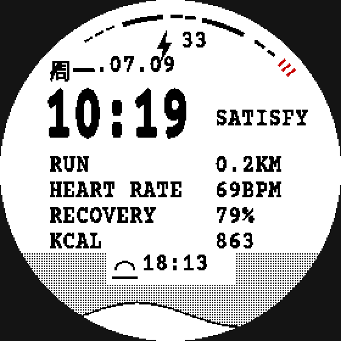

# TypeFace 7X

**A SATISFY-inspired typewriter watch face for Garmin.**

Built for the Fenix 7X / 7X Pro (280×280 MIP display), studying the look of the
SATISFY × COROS APEX 4 exclusive watch faces and recreating that feel on Garmin hardware.

## Features

- Heavy condensed typewriter time display (Courier Prime, bitmap-rendered for crisp 1-bit MIP output)
- Data rows, SATISFY style: RUN (today's distance), HEART RATE, RECOVERY (Body Battery), KCAL
- Chinese weekday date (周一.07.09 style), battery with bolt icon
- Distressed dashed scale along the top arc, with three red ticks at the right end
- Dot-grid halftone band with hill silhouette and next sun event (sunrise / sunset) at the bottom

## Build & install

1. Install VS Code and the official **Monkey C** extension
2. Run `Monkey C: Install SDK` (installs the Connect IQ SDK and device files) and
   `Monkey C: Generate a Developer Key` (first time only)
3. Open this folder, press **F5** and pick `fenix7xpro` to run in the simulator
   - The sun time shows `--:--` until you feed data via *Simulation → Weather*
4. `Monkey C: Build for Device` → copy the generated `.prg` to `GARMIN/Apps/`
   on the watch in USB mass-storage mode

Supported targets: `fenix7xpro`, `fenix7xpronowifi`, `fenix7x` (all 280×280).
Other resolutions need the layout constants adjusted.

## Customization

All layout lives in `source/TypeFaceView.mc` as constants at the top of the class
(coordinates, row positions, the `LABEL` text in the right column, the `DASHES` list
for the top scale).

Two helper scripts (Python 3 + Pillow, `pip install Pillow`):

- `gen_fonts.py` — regenerates the bitmap fonts (`resources/fonts/*.fnt` + PNG atlases)
  from the TTFs. `CourierPrime-Bold.ttf` is bundled; `NotoSansSC.ttf` (~18 MB, only used
  for the 8 weekday glyphs) is not — download the variable font from
  [Google Fonts](https://fonts.google.com/noto/specimen/Noto+Sans+SC) and drop it in the
  project root. The generated bitmap fonts are already committed, so this is only needed
  if you change the glyph set or styling. Size, horizontal condensing, and stroke weight are parameters
  in the last few lines. Swap in any monospace TTF.
- `preview.py` — renders a pixel-exact 280×280 PNG of the face without building or
  flashing anything. Fastest way to iterate on layout; it mirrors the layout constants
  of the Monkey C source, so port your numbers back once you're happy.

## Data notes

- RUN is today's total distance from the activity monitor; HEART RATE is the live
  sensor value if available, otherwise the newest history sample
- RECOVERY shows Garmin Body Battery (0-100). COROS-style recovery / training load
  numbers are not exposed to third-party watch faces by Garmin, so this is the closest match
- The sun row needs weather synced from the phone; otherwise `--:--`
- The red ticks on the top scale can be turned off with `SHOW_RED_TICKS` in the view

## License

Code: [MIT](LICENSE). Fonts: Courier Prime and Noto Sans SC under the
[SIL Open Font License 1.1](OFL.txt).

This is an independent fan project. Not affiliated with SATISFY, COROS, or Garmin.
